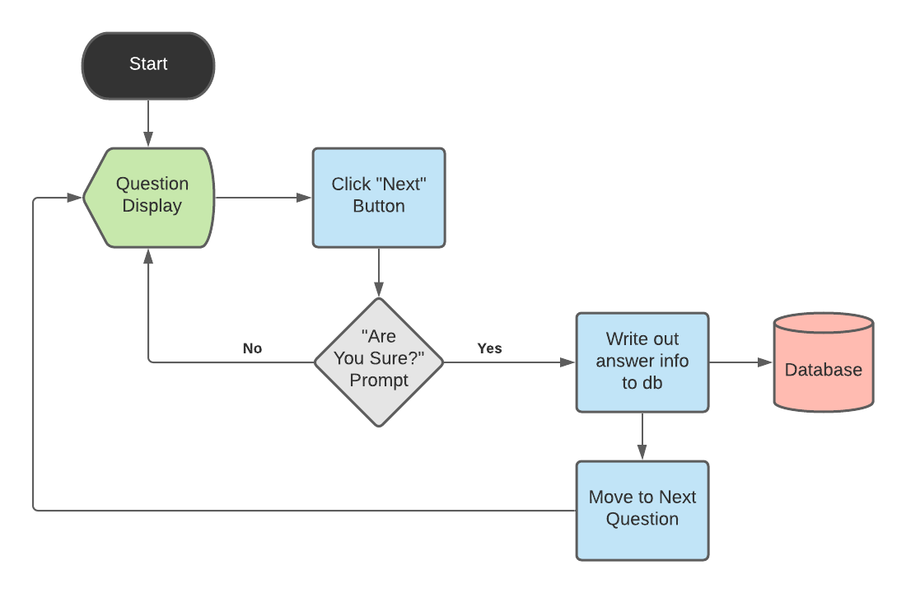

<!-- README.md is generated from README.Rmd. Please edit that file -->

```{r, include = FALSE}
knitr::opts_chunk$set(
  collapse = TRUE,
  comment = "#>"
)
```

# Calibration Training App 

<!-- badges: start -->
<!-- badges: end -->

The goal of the Calibration Training App is to help the [University of Bonn](https://www.uni-bonn.de/en/university/) administer *calibration* assessments ...

## Installation

1. Clone this repository to your local machine

2. Open the **calibration_app.Rproj** file from the directory on your local machine where you cloned this repository. This should install the {renv} package if you do not already have it installed, but if you don't see that happen in the console, run `install.packages("renv")`.

3. Run `renv::restore()` to install the package dependencies needed to run this app successfully

4. Edit the [global.R](global.R) script as necessary (see [below](#app-parameters))

5. Open the [app.R](app.R) file and execute the code in that script to launch the app

### App Parameters

Before a calibration workshop, the [global.R](global.R) script should be edited to define the following parameters for the workshop:

1. The language that questions should be shown in (current options include *English*, *German*, and *Vietnamese*)

2. Google authentication credentials; such credentials are not necessary if the Google Sheet containing the questions is *public*, and require a simple call to `googlesheets4::gs4_deauth()`
    + If the Google Sheet is not public, we recommend reading the [**{googlesheets4}** authentication documentation](https://googlesheets4.tidyverse.org/articles/auth.html) to determine how to configure the appropriate credentials

3. The URL of the Google Sheet's shareable link

4. The specific questions to be used for each group & question type

## Workflow



*** 

See below for session info for full reproducibility: 

```{r session_info}
sessionInfo()
```

